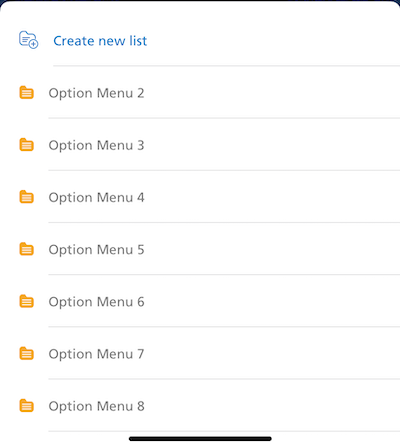
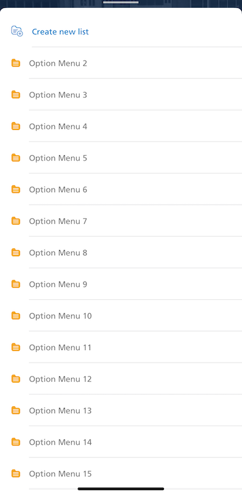

# OptionMenu

[](https://travis-ci.org/Amr/OptionMenu)
[](https://cocoapods.org/pods/OptionMenu)
[](/LICENSE)
[](https://cocoapods.org/pods/OptionMenu)

Showing an option menu should not require alot of stuff to create. This Framework support three themes (Material Design Bottom Sheet, PopOver, Horizontal) for the option menus. That is can be achieved using the minimum code configuration. 





## Usage

```swift

// Data Source

class MyOptionMenuDataSource : ListOptionsMenuDataSource {
    
    func optionsMenuTitle(_ optionsMenu: OptionsMenu) -> String? {
        return nil
    }
    
    func optionsMenuSubtitle(_ optionsMenu: OptionsMenu) -> String? {
        return nil
    }
    
    func optionsCount(_ optionsMenu: OptionsMenu) -> Int {
        
        return 5
        
    }
    
    func optionsMenu(_ optionsMenu: OptionsMenu, optionAtIndex index: Int) -> OptionsMenuItem? {
        
        return OptionsMenuItem(identifier: String(index),
        title: "New Option Menu At \(index)", imageName: "ic_optionmenu")
        
    }
    
}


// Delegate

class MyOptionMenuDelegate : ListOptionsMenuDelegate {
    
    func optionsMenu(_ optionsMenu: OptionsMenu, didSelectOptionAtIndex index: Int) {
        
        print("Did select item at \(index)")
        
    }
    
}


// Style Customization

class MyOptionMenuDataStyle : ListOptionsMenuStyle {

    func optionsMenu(_ optionsMenu: OptionsMenu, fontForItemAtIndex index: Int) -> UIFont? {
       
       return UIFont.systemFont(ofSize: 14)
       
   }
   
   func optionsMenuBackgroundColor(_ optionsMenu: OptionsMenu) -> UIColor? {
       
       return UIColor.white
       
   }
   
 
   func optionsMenuTintColor(_ optionsMenu: OptionsMenu) -> UIColor? {
       return UIColor.black
   }

}

// Inside your View Controller

func show() {

    let myOptionMenu = OptionsMenu(parentViewController: self)
    
    myOptionMenu.behaviour = BottomSheetMenuDisplayBehaviour()
    myOptionMenu.style = MyOptionMenuDataStyle()
    myOptionMenu.dataSource = MyOptionMenuDataSource()
    myOptionMenu.delegate = MyOptionMenuDelegate()

    myOptionMenu.show(animated: true)
    
}

```

## Requirements
iOS 10+

## Example

To run the example project, clone the repo, and run `pod install` from the Example directory first.

## Installation

OptionMenu is available through [CocoaPods](https://cocoapods.org). To install
it, simply add the following line to your Podfile:

```ruby
pod 'OptionMenu'
```

## License

OptionMenu is available under the MIT license. See the LICENSE file for more info.
